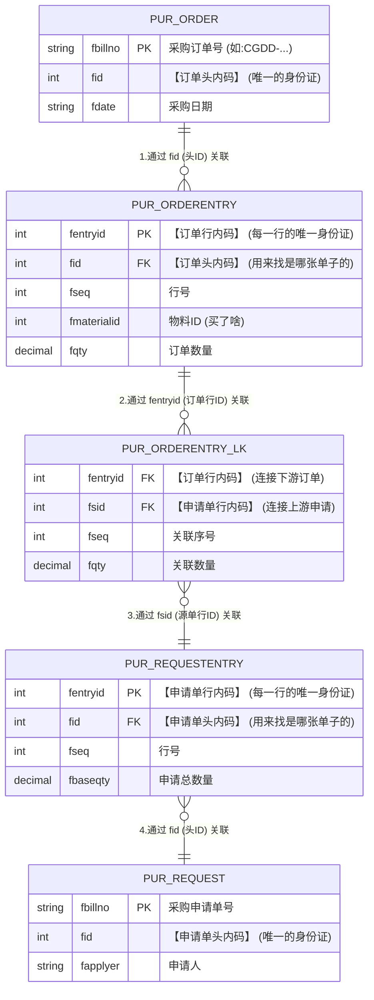

```mermaid
erDiagram
    %% 定义实体（小白版解释）

    PUR_ORDER {
        string fbillno PK "采购订单号 (如:CGDD-...)"
        int fid "【订单头内码】 (唯一的身份证)"
        string fdate "采购日期"
    }

    PUR_ORDERENTRY {
        int fentryid PK "【订单行内码】 (每一行的唯一身份证)"
        int fid FK "【订单头内码】 (用来找是哪张单子的)"
        int fseq "行号"
        int fmaterialid "物料ID (买了啥)"
        decimal fqty "订单数量"
    }

    %% 关键的桥梁表
    PUR_ORDERENTRY_LK {
        int fentryid FK "【订单行内码】 (连接下游订单)"
        int fsid FK "【申请单行内码】 (连接上游申请)"
        int fseq "关联序号"
        decimal fqty "关联数量"
    }

    PUR_REQUESTENTRY {
        int fentryid PK "【申请单行内码】 (每一行的唯一身份证)"
        int fid FK "【申请单头内码】 (用来找是哪张单子的)"
        int fseq "行号"
        decimal fbaseqty "申请总数量"
    }

    PUR_REQUEST {
        string fbillno PK "采购申请单号"
        int fid "【申请单头内码】 (唯一的身份证)"
        string fapplyer "申请人"
    }

    %% 定义联系（连线逻辑）

    %% 1张订单头 有 多行订单明细
    PUR_ORDER ||--o{ PUR_ORDERENTRY : "1.通过 fid (头ID) 关联"

    %% 关键连接：1行订单明细 可能由 1条或多条 关联记录组成
    %% (比如一个订单行是由两个申请单合并来的)
    PUR_ORDERENTRY ||--o{ PUR_ORDERENTRY_LK : "2.通过 fentryid (订单行ID) 关联"

    %% 关键连接：1条关联记录 指向 1行具体的申请单明细
    PUR_ORDERENTRY_LK }o--|| PUR_REQUESTENTRY : "3.通过 fsid (源单行ID) 关联"

    %% 1行申请单明细 属于 1张申请单头
    PUR_REQUESTENTRY }o--|| PUR_REQUEST : "4.通过 fid (头ID) 关联"
```